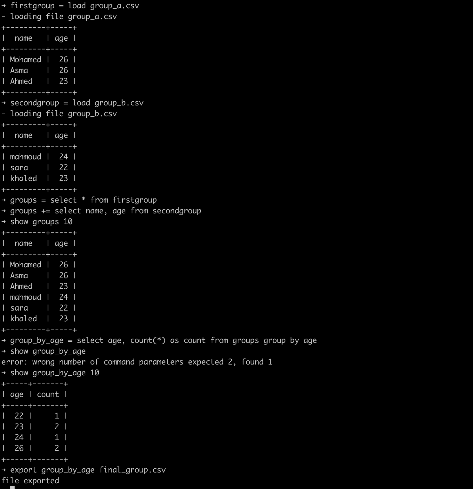

<div align="center">

</div>
<br>

# QueryCSV
enable you to load CSV files and manipulate them using SQL queries then after you finish you can export the new values to CSV file

## Why
it's started with this task that I need to merge 30 CSV file into one file and group it by day instead of the hour, I wrote a couple of lines of code to do that, but I knew it is not going to be the last task that I will need to manipulate the CSV files, so wrote this cmd app to help me on this kind of tasks, I hope that could help too.


## Install
```bash
go install github.com/m7shapan/querycsv
```

## How to use
<div align="center">

</div>
<br>

### Commands

```
load [file.csv]    load only one file or all directory files in case of directory all files should be of the same csv structure

    example:
    testtable = load path/to/file.csv
    testtable = load path/to/files


list    list all existed tables name


show [tablename] [limit] print table data use the limit to limit rows number 

    example:
    show testtable 10


export [tablename] [path/to/exported/file.csv]

    example:
    export testtable testtable.csv

```

## Contact
Mohamed Shapan [@m7shapan](https://twitter.com/M7Shapan)
